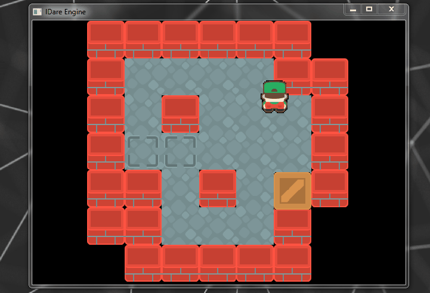

{{"Aspect Ration e Jogos 2D"}}
Em jogos 2D onde usualmente se emprega uma [projeção ortográfica](https://en.wikipedia.org/wiki/Orthographic_projection), o tamanho e proporção dos elementos da cena está intimamente ligado ao aspect ratio. [Aspect ratio](https://en.wikipedia.org/wiki/Aspect_ratio_(image)) é a razão entre a largura e altura da resolução em que se está renderizando. Não considerar esta razão pode resultar em deformações na imagem, o que raramente é o que se deseja na maioria dos jogos.

Existem, entretanto, situações onde não é possível garantir que o [viewport](https://en.wikipedia.org/wiki/Viewport) tenha um aspect ratio correto. Seja por que a janela foi redimensionada ou simplesmente por que a resolução que queremos não é suportada.

Na minha engine considerei algumas alternativas para garantir que os jogos fossem sempre renderizados corretamente. Cada uma delas com seus prós e contras.

## Alternativa 1: Restringir o redimensionamento da janela
Alguns jogos interceptam o redimensionamento da janela, e impedem que ela seja alterada para uma resolução que desrespeite o aspect ratio, fazendo com que a janela incremente automaticamente a largura ou altura enquanto é redimensionada.

### Prós:

Certeza do viewport com aspect ratio correto.

### Contras:

Isso acaba restringindo algumas funcionalidades do SO como [snapping](https://www.addictivetips.com/windows-tips/how-to-snap-windows-using-keyboard-shortcuts-in-windows-10/) de janelas.
Seria difícil garantir isso em dispositivos móveis. Sem falar que depois do Nougat o [splitscreen](https://www.greenbot.com/article/3105486/android/how-to-use-split-screen-mode-in-android-nougat.html) tornou essa abordagem ainda menos viável.

## Alternativa 2: Alterar a resolução do computador

### Prós:

Certeza do viewport com aspect ratio correto.
É possível escrever o jogo para uma única resolução

### Contras:

Essa opção me pareceu invasiva e não garante que o computador/monitor suporte a resolução ou mesmo o aspect ratio que precisamos.

Se não for possível alterar a resolução (talvez por não ser suportada) o jogo não roda ou roda deformado.

O jogo fica responsável por restaurar a resolução quando for fechado. E o jogo travar ou quebrar ?

Novamente, longe do ideal para jogos mobile.

## Alternativa 3: Barras verticais ou horizontais

sta foi a opção que decidi implementar, e consiste calcular um viewport com aspecto correto com base no espaço disponível.

### Prós:
Certeza do viewport com aspect ratio correto.
É possível escrever o jogo para uma única resolução (com alguma engenhosidade)
Funciona com mobile.
As barras só aparecem apenas quando não temos janela/tela com proporções corretas.

### Contras:
Eu sei, barras verticais ou horizontais não são necessariamente a coisa mais bonita de ser ver ao redor do seu jogo.

Implementação
O viewport é calculado sempre que as dimensões da tela mudam, seja redimensionando a janela no PC ou rotacionando o celular.

      void setViewportAspectRatio(uint32 windowWidth, uint32 windowHeight, uint32 virtualWidth, uint32 virtualHeight)
      {
        float targetAspectRatio = virtualWidth / (float) virtualHeight;
        // Try fitting viewport on window width
        int32 viewportWidth = windowWidth;
        int32 viewportHeight = (int)(viewportWidth / targetAspectRatio + 0.5f);
      
        // if height is bigger than width, fit viewport in window height then
        if (viewportHeight > windowHeight)
        {
          viewportHeight = windowHeight;
          viewportWidth = (int)(viewportHeight* targetAspectRatio + 0.5f);
        }
      
      
        // center viewport
        int32 viewportX = (windowWidth / 2) - (viewportWidth / 2);
        int32 viewportY = (windowHeight / 2) - (viewportHeight / 2);
        setViewport(viewportX, viewportY, viewportWidth, viewportHeight);
      
        globalShaderData.baseModelMatrix = Mat4();
        globalShaderData.baseModelMatrix.scale(
            viewportWidth / (float)virtualWidth, 
            viewportHeight / (float)virtualHeight, 1.0f);
      } 
      
      void setViewport(uint32 x, uint32 y, uint32 width, uint32 height)
      {
        globalShaderData.projectionMatrix.orthographic(0, width, 0, height, -1, 1);
        glViewport(x, y, width, height);
      }

Das linhas #3 até #14 a função tenta encaixar um viewport com ratio correto no tamanho atual da tela. Isso é feito utilizando totalmente a menor dimensão – seja  altura ou largura – e calculando proporcionalmente a segunda dimensão. Estes valores são guardados em **viewportWidth** e **viewportHeight** e logo enviados para função setViewport que calcula a matriz de projeção paro novo viewport e armazena numa estrutura que é visível para todos os shaders da engine.

Perceba que os parâmetros **virtualWidth** e **virtualHeight**, representam a resolução virtual do jogo. Por resolução virtual, quero dizer que o jogo poderá ser escrito para uma resolução específica sem se preocupar com o tamanho do viewport. Isso é possível por que nas linhas #22, #23 e #24 é construída a matriz **baseModelMatrix**, que escala os eixos X e Y com base na proporção entre o tamanho do viewport e a resolução ‘virtual’ do jogo.

Esta matriz também é parte da estrutura visível a todos os shaders da engine.  Deste modo, os shaders que desenham sprites precisam apenas multiplicar os vértices dos sprites pelas matrizes de projeção **ProjectionMatrix** e **baseModelMarix** pra garantir tamanho e aspecto corretos. Por exemplo:

      // engine structures automatically included by the engine
      out vec4 fragColor;
      out vec2 texCoord;
      void main()
      {
        fragColor = vec4(vColor, 0.0);
        gl_Position = ldare.projectionMatrix * ldare.baseModelMatrix * vec4(vPos.xy, 1.0, 1.0);
        texCoord = vTexCoord;
      }

## Conclusão

O que particularmente me agrada nesta solução, além da simplicidade, é o fato de permitir assumir uma resolução fixa para o jogo independente do tamanho do viewport. Isso torna a coisas mais simples ao implementar jogos 2D. Principalmente tile based games que assumem tiles simétricos como na imagem acima.
